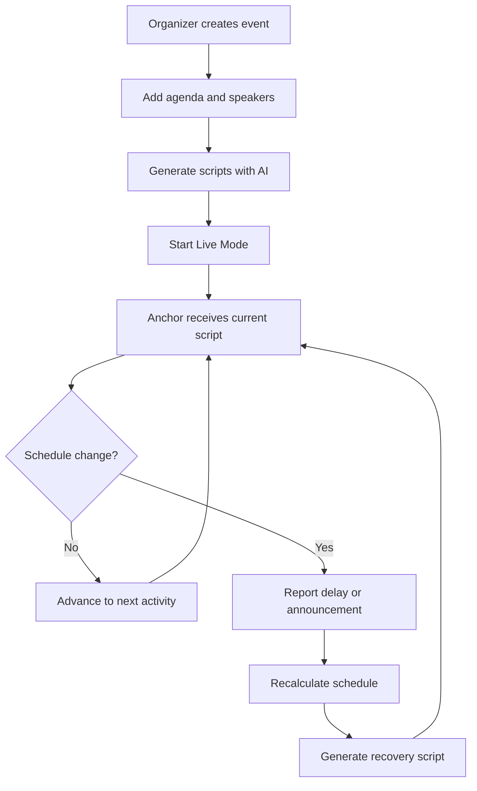

🎙️ AnchorFlow

## 📑 Table of Contents

- [Overview](#-overview)
- [Features](#-features)
- [Tech Stack](#-tech-stack)
- [Platform Workflow](#-platform-workflow)
- [Getting started](#getting-started)
- [Contributors](#-contributors)
- [Why AnchorFlow?](#-why-anchorflow)

---

## 🌐 Overview

Live college events involve speakers, activities, announcements, transitions, and strict schedules. When a speaker is late or an activity runs over time, organizers often coordinate through paper schedules and group chats while the anchor improvises on stage.

**AnchorFlow** gives the event team one shared platform to:

1. **Plan** the event agenda and manage speaker information.
2. **Generate** opening, introduction, transition, filler, announcement, and closing scripts with AI.
3. **Run** the event through a synchronized Organizer Dashboard and Anchor Dashboard.
4. **Recover** from delays by recalculating timings and preparing an immediate anchor-ready script.
5. **Track** the current activity, upcoming activity, countdown, and live event status.

---

## ✨ Features

### 🎛️ Organizer Dashboard

- Create and manage events, agenda items, speakers, and guests.
- Reorder activities and update their timings.
- Review, edit, or regenerate AI-created scripts.
- Start, pause, advance, and end a live event.
- Report delays and publish unexpected announcements.
- Mark a speaker as arrived and notify the anchor instantly.

### 🎤 Anchor Dashboard

- Display a large, distraction-free script for the current moment.
- Show the current activity and its live countdown.
- Preview the next scheduled activity.
- Receive schedule changes and announcements automatically.
- Advance the event using a simple **Mark Done / Next** control.
- Support readable font sizes and light/dark viewing modes.

### 🤖 AI Script Generation

AnchorFlow builds every script from the event context, including its tone, agenda, speakers, previous activity, upcoming activity, and current schedule status.

It can generate:

- Opening scripts
- Speaker introductions
- Activity introductions
- Transition scripts
- Delay filler scripts
- Unexpected announcements
- Closing scripts

### ⏱️ Delay-Aware Schedule Recovery

- Accept a delayed activity and the expected delay duration.
- Calculate how much time can be absorbed through available buffers.
- Shift affected agenda items using deterministic backend logic.
- Generate a context-aware filler or transition script.
- Push the new script, countdown, and schedule to the Anchor Dashboard.

### 🛟 One-Tap Recovery Cards

- Pre-generate scripts for short delays, longer delays, cancellations, and technical issues.
- Display a cached script immediately when a live AI request is slow or unavailable.
- Replace it with a newly generated version when available.

### 🔥 Vibe Meter

- Collect simple crowd-energy feedback from organizers or volunteers.
- Track recent audience energy through a live gauge.
- Suggest a brief re-engagement prompt when energy drops.

---

## 🛠 Tech Stack

| Category          | Technology                      |
| ----------------- | ------------------------------- |
| Frontend          | React, Vite                     |
| Styling           | Tailwind CSS                    |
| Backend           | Node.js                         |
| Database          | SQLite                          |
| ORM               | Prisma                          |
| Real-time updates | Socket.IO with polling fallback |
| AI                | Configurable LLM API            |
| Development       | Nodemon                         |
| Version control   | Git and GitHub                  |

---

## 🔄 Platform Workflow

The organizer and anchor views use the same `LiveEventState`. Socket.IO sends changes immediately, while the live-state API provides a polling fallback.

---

## 🚀 Getting Started
Prerequisites

Make sure you have:

Node.js and npm
Git
Two terminal windows — one for the backend and one for the frontend

AnchorFlow uses SQLite with Prisma, so no separate database server is required.

## 📦 Installation
1. Clone the Repository
git clone https://github.com/prachitabhatia/AnchorFlow.git
cd AnchorFlow

Install backend dependencies:

npm install

Install frontend dependencies:

cd frontend
npm install
cd ..
⚙️ Environment Setup

Create a .env file in the project root by copying .env.example.

Windows PowerShell
Copy-Item .env.example .env
macOS / Linux
cp .env.example .env

Update the .env file:

DATABASE_URL="file:./dev.db"
PORT=4000
ORGANIZER_PASSCODE= dev-passcode
CORS_ORIGIN=http://localhost:5173

AI_PROVIDER=mock
AI_API_KEY=
AI_MODEL=
AI_TIMEOUT_MS=6000

## 🗄️ Database Setup

Run the following commands from the project root:

npx prisma generate
npx prisma migrate deploy

Optional: Load the demo event:

npm run seed

This creates a sample event that can be used to explore the platform.

▶️ Run the Project
Backend

From the project root:

npm run dev

Backend runs at:

http://localhost:4000

Health check:

http://localhost:4000/health
Frontend

Open another terminal:

cd frontend
npm run dev

Frontend runs at:

http://localhost:5173

Keep both terminals running while using AnchorFlow.

## 🔐 Organizer Access

Open:

http://localhost:5173/organizer/events

Enter the ORGANIZER_PASSCODE configured in your .env file.

From the Organizer Dashboard, you can:

Create and manage events
Add speakers and agenda items
Generate AI scripts
Start and control the live event
Handle delays and announcements
Monitor audience feedback

## 🎤 Anchor Access

Open:

http://localhost:5173/anchor/<event-id>

For the demo event:

http://localhost:5173/anchor/demo-event-001

The Anchor Dashboard displays:

Current activity
Live countdown
AI-generated scripts
Upcoming activity
Schedule changes
Live announcements
🧠 Crowd Brain

Audience members can submit quick live feedback through:

http://localhost:5173/crowd-brain/<event-id>

For the demo event:

http://localhost:5173/crowd-brain/demo-event-001

Audience responses are aggregated and analyzed to:

Identify overall audience sentiment
Generate a quick AI summary
Inform the anchor about audience mood
Suggest changes in tone or delivery
Generate a suitable anchor response

The audience does not need an account to submit feedback.

## 🤖 AI Configuration

AnchorFlow supports:

Mock AI — works without an API key
OpenAI
Gemini

By default:

AI_PROVIDER=mock

To use a real AI provider, update the backend .env.

Gemini
AI_PROVIDER=gemini
AI_API_KEY=your-api-key
AI_MODEL=gemini-2.5-flash
OpenAI
AI_PROVIDER=openai
AI_API_KEY=your-api-key
AI_MODEL=gpt-4.1-mini

Restart the backend after changing AI configuration.

Never commit your .env file, API keys, or organizer passcode to GitHub.

🔗 Main Routes
Route	Purpose
/organizer/events	Organizer Dashboard
/organizer/events/new	Create Event
/organizer/events/:id/setup	Event Setup
/organizer/events/:id/speakers	Speaker Management
/organizer/events/:id/agenda	Agenda Management
/organizer/events/:id/scripts	AI Script Management
/organizer/events/:id/live	Live Event Control
/organizer/events/:id/summary	Event Summary
/anchor/:eventId	Anchor Dashboard
/crowd-brain/:eventId	Audience Feedback
📱 Using AnchorFlow on Multiple Devices

To let the anchor or audience join from another device:

Connect all devices to the same Wi-Fi network.
Find the host computer's local IP address.
Replace localhost with that IP address.

## 👩‍💻 Contributors

- [Prachita Bhatia](https://github.com/prachitabhatia)
- Neha Siju

---

## 💡 Why AnchorFlow?

Live events feel most disorganized during transitions, delays, and unexpected announcements—the exact moments when anchors need the clearest guidance. AnchorFlow gives organizers a reliable control layer and gives anchors the right words at the right moment, keeping the stage professional even when the original schedule changes.

---

\

&#x20; Built for smoother events—from the opening welcome to the final sign-off.
\

